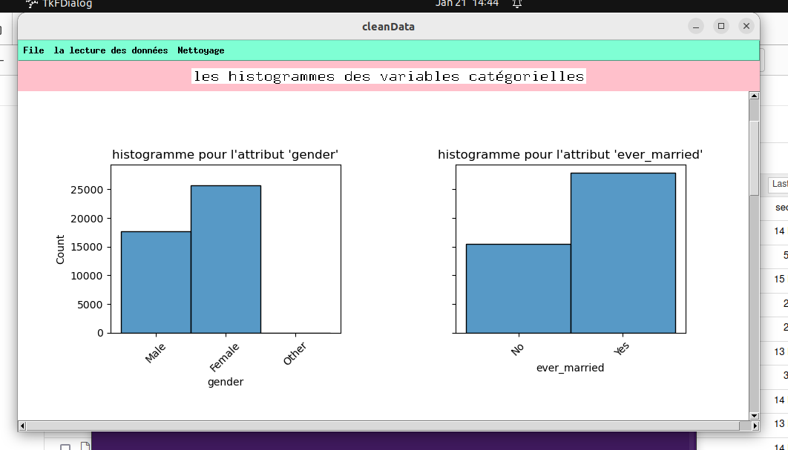
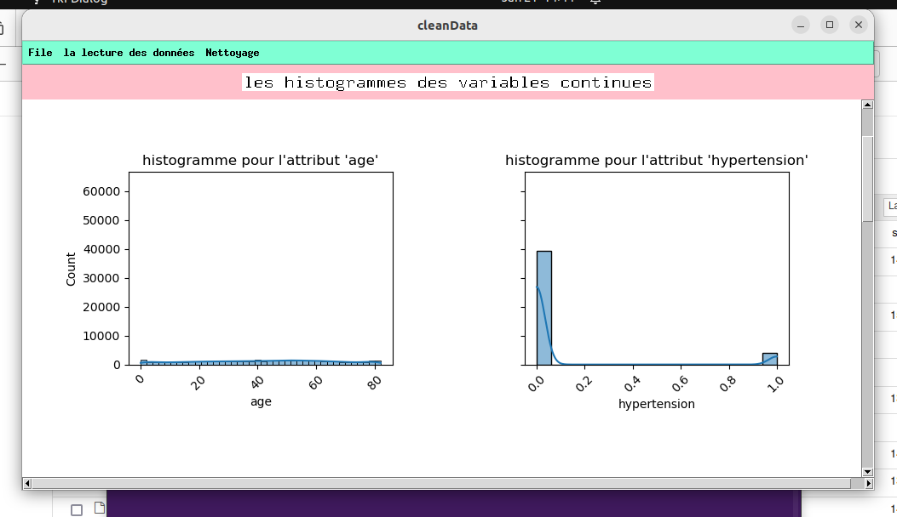

<html>
<body>
    <h2>Table des matières</h2>
<ul>
  <li><a href="#définition">Définition</a></li>
  <li><a href="#technologies_utilisees">Les technologies utilisées</a></li>
  <li><a href="#les-processus">Les processus</a>
    <ul>
      <li><a href="#lancer-lapplication">Lancer l’application</a></li>
      <li><a href="#choisir-le-dataset">Choisir le dataset</a></li>
      <li><a href="#lecture-du-dataset">Lecture du dataset</a></li>
      <li><a href="#nettoyage-des-données">Nettoyage des données</a></li>
      <li><a href="#récupérer-les-données-nettoyées">Récupérer les données nettoyées</a></li>
    </ul>
  </li>
</ul>

<h2 id="définition">Définition</h2>

cleanData une app desktop qui permet pour nettoyer une dataset par l'utilisation des algorithmes de machine learning comme:
<ul>
    <li>Les algorithmes de Classification</li>
    <li>Les algorithmes de Régression</li>
</ul>
pour trouver une bon résultat.

<h2 id="technologies_utilisees">Les technologies utilisées</h2>
<h4>Voici les technologies utilisées dans votre application de nettoyage de données développée avec Tkinter :</h4>
<ul class="menu">
  <li>Tkinter</li>
  <ul>
    <li>Utilisé pour créer l'interface graphique de l'application.</li>
    <li>Composants utilisés : Canvas, Menu, Label, Button, Treeview, Scrollbar, etc.</li>
  </ul>
  <li>Scikit-learn</li>
    <ul>
    <li>Prétraitement des données, y compris la normalisation avec StandardScaler.</li>
    <li>Division des ensembles de données en ensembles de formation et de test (train_test_split).</li>
    <li>Modélisation prédictive avec divers algorithmes d'apprentissage automatique, notamment :</li>
    <ul>
      <li>Régression linéaire (LinearRegression)</li>
      <li>Régression logistique (LogisticRegression)</li>
      <li>Arbre de décision pour la régression et la classification (DecisionTreeRegressor, DecisionTreeClassifier)</li>
      <li>Forêt aléatoire pour la régression et la classification (RandomForestRegressor, RandomForestClassifier)</li>
      <li>K-plus proches voisins pour la régression et la classification (KNeighborsRegressor, KNeighborsClassifier)</li>
    </ul>
    <li>Équilibrage des classes avec RandomOverSampler d'imblearn.</li>
    <li>Évaluation des modèles avec des métriques comme accuracy_score, recall_score, roc_auc_score, precision_score, f1_score, classification_report, confusion_matrix.</li>
    </ul>
  <li>Imbalanced-learn (imblearn)</li>
     <ul><li>Traitement des jeux de données déséquilibrés avec RandomOverSampler.</li></ul>
  <li>Matplotlib</li>
    <ul>
      <li>Utilisé pour créer des graphiques et des visualisations de données.</li>
      <li>Intégré avec Tkinter via FigureCanvasTkAgg pour afficher les graphiques dans l'application.</li>
    </ul>
  <li>Seaborn</li>
    <ul><li>Utilisé pour créer des graphiques statistiques, en particulier des histogrammes pour les variables catégorielles et continues.</li></ul>
  <li>Pandas</li>
    <ul>
      <li>Utilisé pour lire et manipuler les datasets CSV.</li>
      <li>Effectue des opérations comme le nettoyage de données, la suppression de colonnes, l'analyse des types de variables, etc.</li>
    </ul>
  <li>tkhtmlview</li>
  <ul>
    <li>Utilisé pour afficher du contenu HTML dans l'interface Tkinter.</li>
  </ul>
  <li>Numpy</li>
    <ul>
      <li>Utilisé pour des opérations numériques et des manipulations de données complémentaires.</li>
    </ul>
  <li>OS</li>
    <ul>
      <li>nteractions avec le système de fichiers.</li>
    </ul>
  <li>Missingno</li>
    <ul>
      <li>Visualisation des données manquantes.</li>
    </ul>
</ul>

<h2 id="les-processus">Les processus</h2>

<h3 id="lancer-lapplication">1. Lancer l’application</h3>
  

  
 

<h3 id="choisir-le-dataset">2. Choisir le dataset</h3>
  <h4>Cliquer sur ouvrir</h4>
  

  
 

 <h4>Après le clic sur ouvrire choisir le dataset</h4>
  

  
 

<h3 id="lecture-du-dataset">3. Lecture du dataset</h3>
  <h4>Cliquer sur le menu 'Lecture des données' et choisir l'affichage que vous voulez.</h4>
  

    
  

  <h4>Afficher dataset sous forme de table :</h4>
  

    
  

  <h4>afficher les informations de dataset </h4>
  <ul>
    <li>le nombre des lignes</li>
    <li>le nombre des colonnes</li>
    <li>les attribut numériques</li>
    <li>les attribut catégoriales</li>
    <li>les attributs qui contiennent des valeurs manquantes</li>
  </ul>
  

    
  

  <h4>Afficher les histogrammes</h4>
  <h5> - les attributs catégorielles</h5>
  

    
  

  <h5> - les attributs continues</h5>
  

    
  

  <h5> - Afficher la matrice de corrélation :</h5>
  

    
  

<h3 id="nettoyage-des-données">4. Nettoyage des données</h3>
  <h4>Cliquer sur le menu "netouayer"</h4>
  

    
  

  <h4>Et après cliquer sur ok</h4>
  

    
  

  <h4>Et attendre quelque minute jusqu'à le traitement est fini.</h4>
  

    
  

  <h4>une fois le traitement est fini, on va afficher une message qui vous dit que le traitement est fini.
avec une bouton pour télécharger le dataset nettoyer.</h4>
  

    
  

  <h4>Et après cliquer sur ok pour charger votre dataset nettoyer.</h4>
      

        
      

<h3 id="récupérer-les-données-nettoyées">5. Récupérer les données nettoyées</h3>
 <h4>Finalement aller le dossier téléchargement à cote de l'application pour récupère le data nettoyer.</h4>

</body>
</html>
